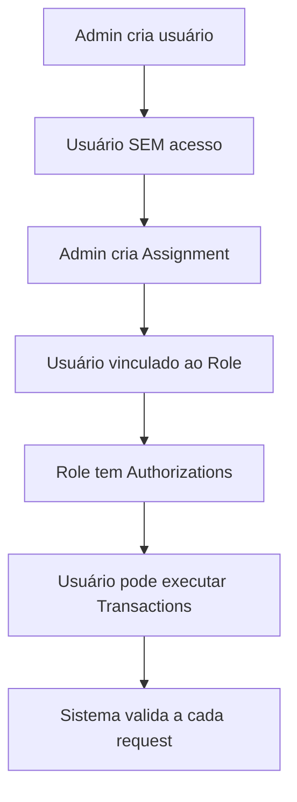

# 🔐 **SISTEMA DE PERMISSÕES - GUIA COMPLETO**

## 🚀 **COMO UM USUÁRIO NOVO GANHA PERMISSÕES**

### **1. Criação do Usuário (SEM PERMISSÕES)**

```http
POST /users/
Content-Type: application/json

{
    "username": "novo_funcionario",
    "display_name": "João Silva", 
    "email": "joao@empresa.com",
    "password": "senha123"
}
```

**⚠️ IMPORTANTE**: Este endpoint **NÃO requer autenticação** e **NÃO atribui permissões**. O usuário fica completamente **sem acesso** ao sistema.

### **2. Atribuição de Role via Assignment**

Para dar permissões, um **administrador** deve criar um Assignment:

```http
POST /assignment/
Authorization: Bearer <token_admin>
Content-Type: application/json

{
    "user_id": 123,
    "role_id": 2
}
```

**Quem pode fazer?** Apenas usuários com permissão `OP_1010001` (Assignment - Create).

### **3. Cadeia de Permissões (RBAC)**

```
👤 User → 🔗 Assignment → 👥 Role → ✅ Authorization → 🔧 Transaction
   João   →   vincula   → Admin →   autoriza    → Criar Usuário
```

**Validação**: A função `validate_transaction_access()` verifica esta cadeia completa antes de permitir qualquer operação.

## 🆕 **COMO CRIAR NOVAS PERMISSÕES**

### **1. Definir Código de Operação**

Primeiro, adicione no enum de códigos:

```python
# app/api/transaction/enum_operation_code.py
class EnumOperationCode(Enum):
    # ... códigos existentes ...
    
    # --------------------- Nova Funcionalidade ---------------------
    OP_5000001 = '5000001'  # Relatórios - Gerar
    OP_5000002 = '5000002'  # Relatórios - Visualizar  
    OP_5000003 = '5000003'  # Relatórios - Excluir
```

### **2. Criar Nova Transaction**

```http
POST /transaction/
Authorization: Bearer <token_admin>
Content-Type: application/json

{
    "name": "Relatórios - Gerar",
    "description": "Gerar relatórios financeiros do sistema",
    "operation_code": "5000001"
}
```

**Quem pode fazer?** Apenas usuários com permissão `OP_1030001` (Transaction - Create).

### **3. Autorizar Roles para a Nova Transaction**

```http
POST /authorization/
Authorization: Bearer <token_admin>
Content-Type: application/json

{
    "role_id": 2,        # Role "Gerente"  
    "transaction_id": 456 # Transaction "Relatórios - Gerar"
}
```

**Quem pode fazer?** Apenas usuários com permissão `OP_1020001` (Authorization - Create).

### **4. Implementar Validação no Endpoint**

```python
@router.post('/relatorios/gerar')
def gerar_relatorio_financeiro(
    db_session: SessionDep,
    current_user: CurrentUser,
):
    # ✅ Validar permissão antes de executar
    validate_transaction_access(db_session, current_user, '5000001')
    
    # 🔧 Lógica do relatório aqui...
    return {"message": "Relatório gerado com sucesso"}
```

## 📊 **ESTRUTURA HIERÁRQUICA TÍPICA**

```
🔥 SUPER ADMIN (todas as permissões)
├── 👨‍💼 ADMIN (gerenciar usuários, roles, autorizações)  
├── 📈 GERENTE (operações de negócio, relatórios)
├── ⚙️ OPERADOR (operações básicas do dia-a-dia)
└── 👁️ VISITANTE (apenas consultas/leitura)
```

## 🔍 **CONSULTAR PERMISSÕES DE UM USUÁRIO**

```http
GET /users/{user_id}/transactions
Authorization: Bearer <token_admin>
```

**Quem pode fazer?** Apenas usuários com permissão `OP_1040006` (User - Transactions granted).

**Retorna**: Lista de todas as transactions/operações que o usuário pode executar.

## 📋 **CENÁRIOS PRÁTICOS COMPLETOS**

### **Cenário 1: Novo Funcionário (Operador)**

```bash
# 1. Admin cria o usuário (sem permissões)
curl -X POST /users/ \
  -H "Content-Type: application/json" \
  -d '{"username":"maria","display_name":"Maria Santos","email":"maria@empresa.com","password":"senha123"}'

# 2. Admin atribui role "Operador" (ID 3)
curl -X POST /assignment/ \
  -H "Authorization: Bearer <admin_token>" \
  -H "Content-Type: application/json" \  
  -d '{"user_id":123,"role_id":3}'

# 3. Maria agora pode fazer operações básicas definidas no role "Operador"
```

### **Cenário 2: Promoção para Gerente**

```bash
# 1. Admin remove assignment atual
curl -X DELETE /assignment/456 \
  -H "Authorization: Bearer <admin_token>"

# 2. Admin cria novo assignment com role "Gerente"  
curl -X POST /assignment/ \
  -H "Authorization: Bearer <admin_token>" \
  -H "Content-Type: application/json" \
  -d '{"user_id":123,"role_id":2}'
```

### **Cenário 3: Nova Funcionalidade - Backup do Sistema**

```bash
# 1. Admin cria nova transaction
curl -X POST /transaction/ \
  -H "Authorization: Bearer <admin_token>" \
  -H "Content-Type: application/json" \
  -d '{"name":"Backup - Executar","description":"Executar backup do banco de dados","operation_code":"6000001"}'

# 2. Admin autoriza role "TI" para fazer backup
curl -X POST /authorization/ \
  -H "Authorization: Bearer <admin_token>" \
  -H "Content-Type: application/json" \
  -d '{"role_id":4,"transaction_id":789}'

# 3. Todos os usuários com role "TI" agora podem executar backup
```

## 🛡️ **SISTEMA DE SEGURANÇA**

### **Validações Automáticas**
- ✅ Todos os endpoints (exceto criação de usuário) exigem autenticação JWT
- ✅ Cada operação valida se o usuário tem a permissão específica
- ✅ Sistema previne escalação de privilégios não autorizada
- ✅ Auditoria completa com IP e usuário em todas as operações

### **Exceções de Segurança**
- 🚫 `IllegalAccessException` - Usuário não tem permissão
- 🚫 `AmbiguousAuthorizationException` - Múltiplas autorizações conflitantes  
- 🚫 `CredentialsValidationException` - Token inválido/expirado

## 🎯 **FLUXO RESUMIDO DE UM NOVO USUÁRIO**



- **Users** recebem **Roles** via **Assignments**
- **Roles** têm permissões via **Authorizations** para **Transactions** específicas  
- Cada endpoint valida a cadeia completa antes de permitir a operação
- Auditoria total de quem fez o que, quando e de onde 
